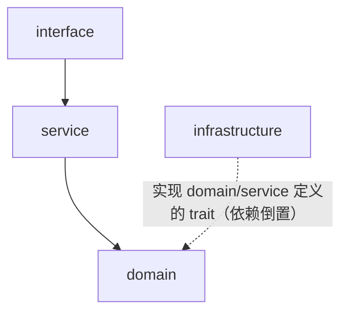

# Rust 开发笔记

> 分类：一、安装与环境 ｜ 二、命令速查 ｜ 三、项目结构 ｜ 四、配置管理 ｜ 五、开发流程
> 文中「编码规范第 X 章」指 AI 编码规范（CLAUDE.md），其余编号均为本文档内部章节。

## 一、安装与环境

### 1.1 创建安装目录（管理员执行）

```bash
mkdir -p /data/rust/{cargo,rustup}
chown -R $USER:$(id -gn) /data/rust
chmod -R 755 /data/rust
```

### 1.2 配置环境变量（ec2-user 执行）

```bash
cat >> ~/.bashrc <<'EOF'
export CARGO_HOME="/data/rust/cargo"
export RUSTUP_HOME="/data/rust/rustup"
export PATH="$CARGO_HOME/bin:$PATH"
EOF

source ~/.bashrc
```

### 1.3 非交互安装 Rust（不让安装程序修改 PATH）

```bash
dnf install -y gcc gcc-c++ make
curl --proto '=https' --tlsv1.2 -sSf https://sh.rustup.rs \
  | sh -s -- -y --no-modify-path
```

### 1.4 验证安装

```bash
which rustc
which cargo
which rustup

rustc --version
cargo --version
rustup --version
```

## 二、命令速查

### 2.1 cargo

```bash
cargo new myapp          # 新建二进制项目（--lib 新建库项目）
cargo init               # 在当前目录初始化项目
cargo check              # 只做类型检查不生成产物，日常最快的验证方式
cargo build              # 编译 debug 版，产物在 target/debug/
cargo build --release    # 编译发布版（开优化），产物在 target/release/
cargo run                # 编译并运行
cargo test               # 运行测试
cargo fmt                # 格式化代码
cargo clippy             # 静态检查（lint）
cargo add serde          # 添加依赖（自动写入 Cargo.toml）
cargo remove serde       # 移除依赖
cargo update             # 按 Cargo.toml 的版本约束更新 Cargo.lock
cargo doc --open         # 生成并打开 API 文档
cargo clean              # 删除 target/ 构建产物
```

### 2.2 rustup

```bash
rustup show              # 查看已安装的工具链和当前默认
rustup update            # 更新工具链
rustup component add rustfmt clippy   # 安装组件（默认已含）
```

## 三、项目结构

### 3.1 标准布局（cargo new 生成）

```text
myapp/
├── Cargo.toml           # 项目清单：包信息、依赖声明
├── Cargo.lock           # 依赖锁文件，应提交入库
├── src/
│   ├── main.rs          # 二进制入口（fn main）
│   └── lib.rs           # 库入口（可与 main.rs 共存，逻辑放库里便于测试）
├── tests/               # 集成测试，每个文件是独立测试目标
├── examples/            # 示例程序，cargo run --example xxx
├── benches/             # 基准测试
└── target/              # 构建产物，不入库（加入 .gitignore）
```

### 3.2 生产级完整结构（分层架构）

```text
my-project/
│
├── Cargo.toml               # 发布优化 profile 见 5.6
├── Cargo.lock
├── rust-toolchain.toml      # 钉死工具链版本，团队与 CI 一致（见 5.1）
│
├── .cargo/
│   └── config.toml          # cargo 行为配置：镜像源、构建参数、别名
│                            #   如 [alias] ck = "clippy --all-targets -- -D warnings"
│
├── .gitignore               # 至少排除 target/、.env、config/prod.toml
├── .env.example             # 环境变量模板：只有 key 和注释，无真实值，入库
├── README.md                # 项目说明：干什么、怎么跑起来、怎么测试
├── Makefile                 # 常用命令入口：make dev / test / lint / release
│                            #   统一入口让新人不用记 cargo 参数组合
│
├── config/                  # 分环境配置（加载规则与密钥约定见第四章）
│   ├── default.toml         # 公共默认值：所有环境共享的基线
│   ├── dev.toml             # 开发环境覆盖：本地地址、debug 日志
│   ├── test.toml            # 测试环境覆盖：CI / 集成测试专用
│   └── prod.toml.example    # 生产配置模板；真实 prod.toml 由部署系统下发，不入库
│
├── src/
│   ├── main.rs              # 二进制入口：只做一件事——调用 app::bootstrap 然后运行
│   │                        #   保持 10 行以内，所有逻辑放 lib 里以便测试
│   ├── lib.rs               # 库入口：声明各模块（pub mod app; pub mod domain; ...）
│   │
│   ├── app/                 # 应用装配层：把所有零件组装起来
│   │   ├── mod.rs
│   │   ├── bootstrap.rs     # 启动流程：加载配置 → 初始化日志 → 建连接池
│   │   │                    #   → 装配依赖 → 注册路由 → 挂优雅停机信号
│   │   └── state.rs         # 共享状态 AppState：持有配置、连接池、各 Service 实例
│   │                        #   （axum 的 State / actix 的 Data 传入 handler）
│   │
│   ├── config/              # 配置模块（小项目一个 config.rs 即可，规模大时拆成目录）
│   │   ├── mod.rs           # 对外只暴露 Config::load()，隐藏加载细节
│   │   ├── model.rs         # 配置结构体定义：ServerConfig、DatabaseConfig 等
│   │   ├── loader.rs        # 加载合并逻辑（优先级规则见 4.1）
│   │   └── validate.rs      # 启动时校验：端口范围、URL 格式、必填项，失败即退出
│   │
│   ├── domain/              # 领域层：纯业务概念和规则，最核心
│   │   ├── mod.rs
│   │   ├── model.rs         # 业务实体（如 Order、User），只含数据和业务规则
│   │   └── error.rs         # 业务错误（如 OrderNotFound、InsufficientBalance）
│   │
│   ├── service/             # 服务层：业务用例编排，事务边界在这一层（编码规范 8.3）
│   │   ├── mod.rs
│   │   └── order_service.rs # 例：创建订单 = 校验库存 + 扣款 + 落库，组合 domain
│   │                        #   与 infrastructure；按业务职责一个用例一个文件
│   │
│   ├── infrastructure/      # 基础设施层：所有和外部世界打交道的实现
│   │   ├── mod.rs
│   │   ├── database/        # 数据库访问（Repository 实现、连接池、migration 调用）
│   │   ├── cache/           # Redis 等缓存客户端封装
│   │   ├── http_client/     # 调用第三方 API 的客户端（统一超时、重试，编码规范 8.2）
│   │   └── filesystem/      # 文件读写封装
│   │
│   ├── interface/           # 接口层：外部请求的入口，只做协议转换不含业务逻辑
│   │   ├── mod.rs
│   │   ├── http/            # HTTP：路由、handler、请求/响应 DTO、中间件
│   │   │                    #   handler 只做：解析参数 → 调 service → 包装 Result<T>
│   │   └── cli/             # 命令行子命令入口（如 migrate、导数据等运维命令）
│   │
│   ├── observability/       # 可观测性（编码规范 8.1）
│   │   ├── mod.rs
│   │   ├── logging.rs       # tracing 初始化：结构化日志、trace_id 中间件注入
│   │   └── metrics.rs       # 指标：请求延迟、错误率，暴露 /metrics 端点
│   │
│   └── error.rs             # 顶层错误类型：聚合各层错误，统一映射为 HTTP 错误码
│
├── tests/                   # 集成测试：走真实数据库/依赖（testcontainers，编码规范第 3 章）
│   ├── common/
│   │   └── mod.rs           # 测试公共设施：起测试环境、造数据、清理
│   ├── config_test.rs       # 例：验证各环境配置文件能正确加载和校验
│   └── integration_test.rs  # 例：走完整 HTTP 请求链路的端到端用例
│
├── examples/
│   └── simple.rs
│
├── benches/                 # 只给性能敏感路径写
│   └── benchmark.rs
│
├── scripts/                 # 工程脚本，CI 和本地共用同一套，避免两边行为不一致
│   ├── build.sh
│   ├── test.sh              # 测试 + 覆盖率门禁（对应 5.5 合并前门禁）
│   └── release.sh
│
├── deploy/                  # 部署产物定义，与代码同仓库便于版本对应
│   ├── docker/              # Dockerfile、compose 文件
│   ├── systemd/             # myapp.service 单元文件（VM 直接部署时用）
│   └── k8s/                 # Deployment/Service/ConfigMap 清单（配 liveness/readiness）
│
└── docs/
    ├── architecture.md      # 架构说明：分层职责、依赖方向、关键决策及理由
    ├── configuration.md     # 全部配置项清单：名称、类型、默认值、含义
    └── deployment.md        # 部署步骤、回滚方法、环境差异说明
```

### 3.3 分层依赖方向

各层职责见 3.2 树注释；只能从上往下依赖，禁止反向、禁止循环。



app 在最外层装配所有依赖（依赖注入发生在这里）；config / observability / error 是横切模块，各层均可使用。

关键规则：

- domain 不 import 任何框架（axum/sqlx/redis），保证业务逻辑可脱离基础设施单测
- service 依赖 trait 而非具体实现，测试时用内存实现替换数据库（编码规范第 3 章）
- 换一个 HTTP 框架不应触碰 service 和 domain
- 每层的错误各自定义，向上传播时附加上下文，顶层 error.rs 统一转应答码（编码规范第 6 章）

### 3.4 规模裁剪（避免过度工程，编码规范第 2 章）

3.2 是中大型服务的完整形态，小项目按需折叠，演化路径：

| 规模 | 结构 |
|---|---|
| 小工具 | main.rs + config.rs + error.rs 三个文件即可 |
| 小服务 | src/ 下每层收成单文件（domain.rs、service.rs、infra.rs、http.rs） |
| 中大型 | 3.2 的完整目录结构 |

判据：某层只有一个文件且不再增长，就不必为它建目录；第二个实现真实出现时才引入 trait 抽象，不预先设计。

### 3.5 多入口二进制（类似 Go 的 cmd/ 模式）

```text
project/
├── Cargo.toml               # src/bin/*.rs 自动发现为二进制，无需 [[bin]] 声明；
│                            #   需要改二进制名/路径时才显式写 [[bin]]；
│                            #   [package] 里加 default-run = "server" 可设默认入口
└── src/
    ├── lib.rs               # 库：全部共享逻辑（config、service、infrastructure ...）
    │                        #   入口文件通过 use <包名>::... 引用库
    └── bin/
        ├── server.rs        # 二进制 server：HTTP 常驻服务
        ├── worker.rs        # 二进制 worker：消费队列的后台进程
        └── cli.rs           # 二进制 cli：migrate、导数据等运维子命令
                             # 入口只做参数解析和启动（20 行以内），业务逻辑全在 lib
```

构建与运行命令：

```bash
cargo build                        # 构建全部二进制（server、worker、cli 一起编译）
cargo build --bin server           # 只构建 server
cargo build --release              # 发布版全部构建，产物：
                                   #   target/release/server
                                   #   target/release/worker
                                   #   target/release/cli

cargo run --bin server             # 运行指定二进制
cargo run --bin worker
cargo run --bin cli -- migrate     # -- 之后是传给程序自身的参数
APP_ENV=prod cargo run --bin server    # 配合 4.1 的环境选择

cargo check --bin cli              # 只检查单个入口
cargo test                         # 测试跑的是库（lib.rs）里的逻辑，与入口无关
cargo install --path . --bin cli   # 把 cli 装到 $CARGO_HOME/bin 全局使用
```

与 Go cmd/ 模式的对应关系：

| | 入口 + 共享代码 | 构建命令 |
|---|---|---|
| Go | cmd/server/main.go + 根目录包 | `go build ./cmd/server` |
| Rust | src/bin/server.rs + src/lib.rs 库 | `cargo build --bin server` |

差异：Rust 无需每个入口一个目录，bin/ 下单文件即一个二进制；入口膨胀需要拆多文件时，可改用 `src/bin/server/main.rs` 目录形式。

## 四、配置管理（分环境配置）

环境相关的可变配置统一放 config/ 目录，禁止硬编码在业务代码中。按「公共配置 + 环境覆盖」两层组织，通过环境变量选择当前环境。目录布局见 3.2 结构树的 config/、.env.example 与 src/config/ 部分，本章只讲规则。

### 4.1 加载规则

优先级从低到高，后者覆盖前者：

```text
default.toml  →  {APP_ENV}.toml  →  环境变量（APP__ 前缀）
```

```bash
APP_ENV=dev cargo run          # 加载 default.toml + dev.toml
APP_ENV=prod ./myapp           # 加载 default.toml + prod.toml
# APP_ENV 未设置时默认 dev（本地最安全的选项）
```

### 4.2 依赖引入

```bash
cargo add config                 # 配置加载（支持 TOML + 环境变量分层覆盖）
cargo add serde --features derive
```

### 4.3 约定

- 密钥（数据库密码、API key、Token）只走环境变量或 .env，禁止写入 config/ 和代码仓库
- .gitignore 加入 .env；config/*.toml 中不含敏感值的可入库
- 每个配置项有清晰命名、默认值和注释说明，集中定义在一个结构体中
- 启动时一次性加载并校验（缺失必填项直接报错退出，fail-fast），不在运行中散落读取

## 五、开发流程

### 5.1 初始化：建项目、进版本管理、钉工具链

```bash
cargo new myapp
cd myapp
git init

cat > rust-toolchain.toml <<'EOF'
[toolchain]
channel = "1.93.0"       # 填当前使用的稳定版（rustc --version 查看），团队与 CI 保持一致
components = ["rustfmt", "clippy"]
EOF
```

### 5.2 安装质量工具（一次性，装到 $CARGO_HOME/bin 全局可用）

```bash
cargo install cargo-audit      # 依赖漏洞扫描（RustSec 通告库）
cargo install cargo-llvm-cov   # 测试覆盖率
cargo install cargo-deny       # 许可证 / 漏洞 / 重复依赖审查，比 audit 更全（可选）
```

### 5.3 日常开发循环：先写测试，再写最小实现使测试通过

```bash
cargo check                    # 改完代码先快速验证能否编译
cargo test                     # 跑测试
cargo fmt                      # 提交前格式化
cargo clippy -- -D warnings    # lint，警告视为错误
```

每完成一处可独立 revert 的修改就 commit 一次，不攒批。

### 5.4 依赖管理

```bash
cargo add serde --features derive   # 加依赖走 cargo add，钉具体版本，禁止宽松范围
cargo audit                         # 引入新依赖后跑一次漏洞扫描
```

Cargo.lock 必须提交入库；升级依赖用 `cargo update` 并单独 commit。

### 5.5 合并前门禁（CI 执行同样四条，任一失败不得合并）

```bash
cargo fmt --check
cargo clippy --all-targets -- -D warnings
cargo test
cargo llvm-cov --fail-under-lines 80    # 覆盖率下限按项目要求调整
```

### 5.6 发布构建

```bash
cargo build --release          # 产物在 target/release/myapp
```

Cargo.toml 可加发布优化：

```toml
[profile.release]
lto = true                     # 链接期优化，提升运行性能
strip = true                   # 去除符号，减小二进制体积
```
